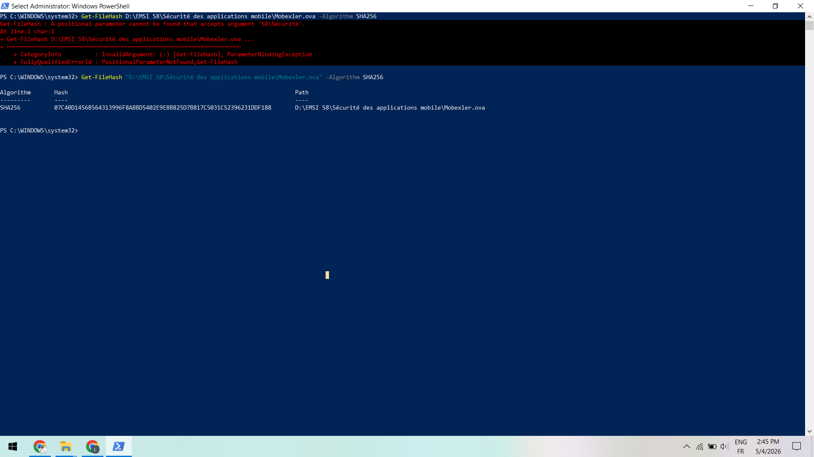
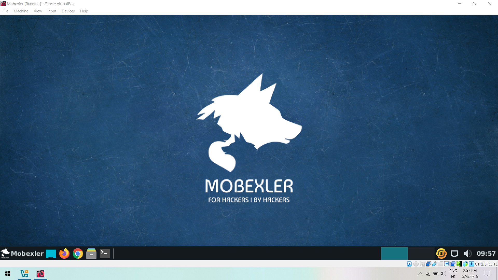
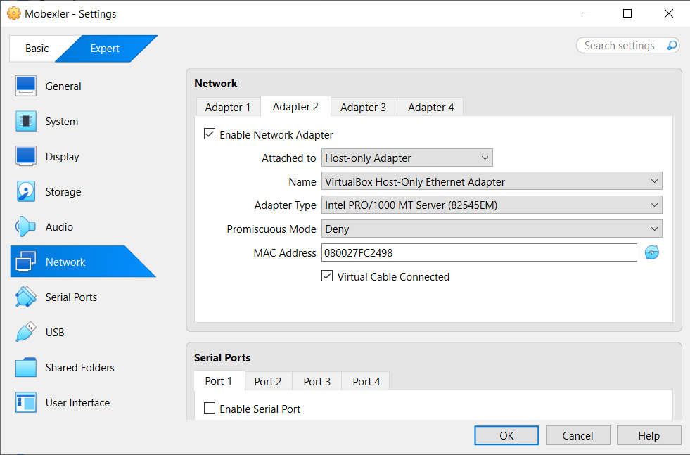
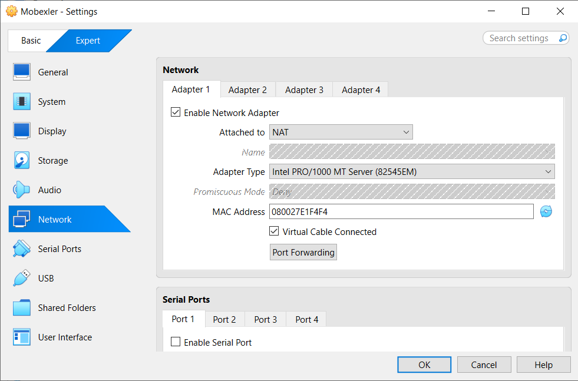
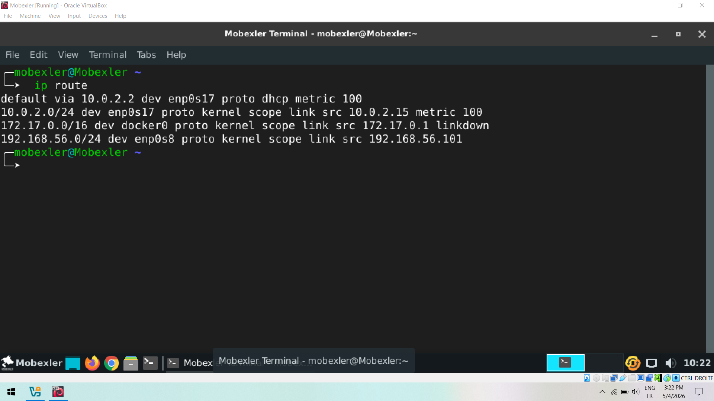
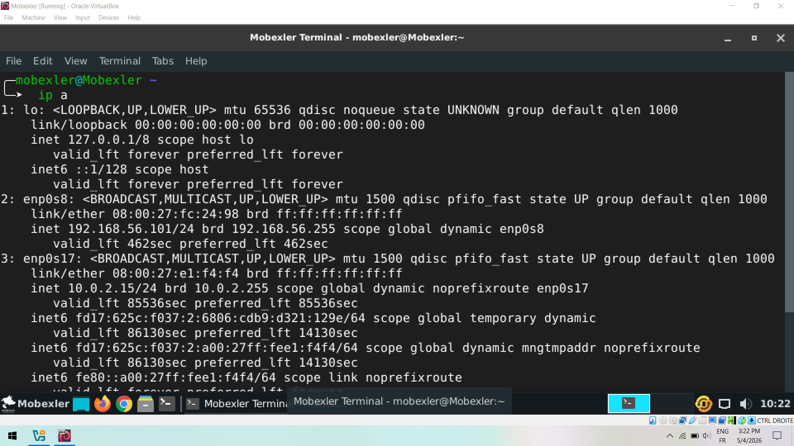
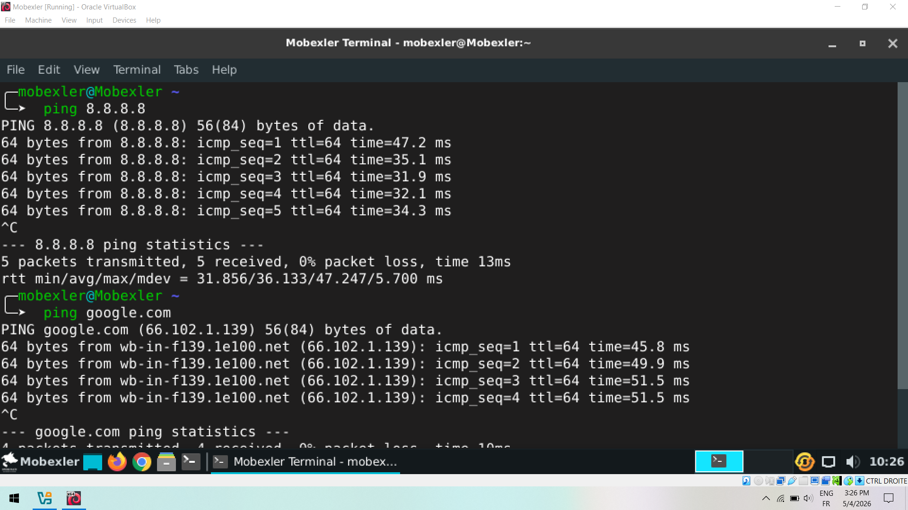
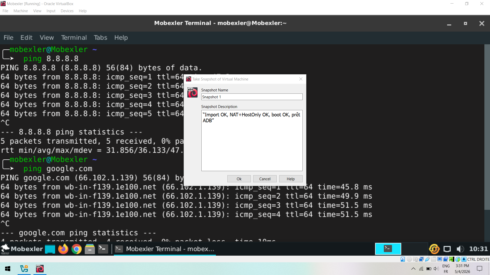
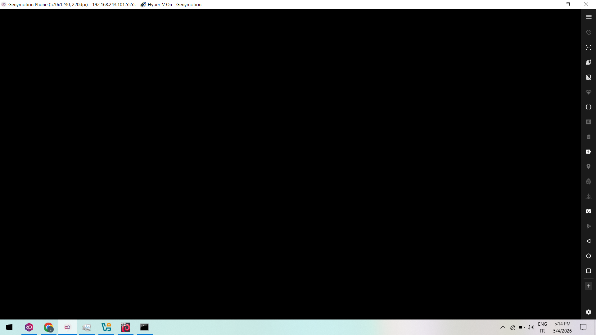
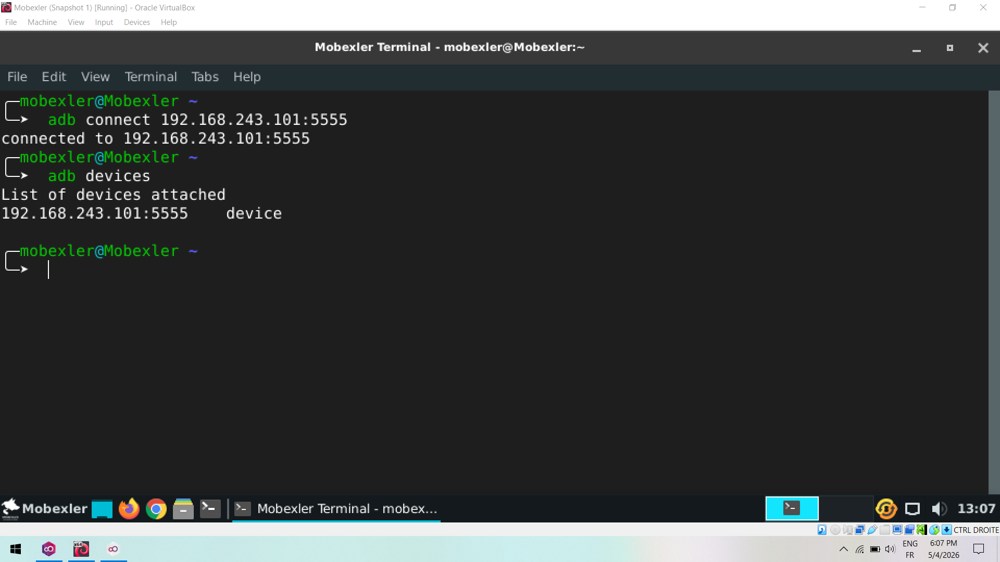

# 🔐 Lab Sécurité des Applications Mobiles — Environnement Mobexler

## 📥 Étape 1 — Téléchargement et vérification de l’OVA

### 📸 Capture 1 — Calcul du hash SHA256 réussi



✅ Le hash SHA256 du fichier Mobexler.ova a été calculé avec succès en utilisant PowerShell.

---

## 🖥️ Étape 2 — Importation de la VM Mobexler

### 📸 Capture 2 — Lancement de la VM Mobexler



✅ La machine virtuelle Mobexler a été importée et démarrée correctement dans VirtualBox.

---

### 📸 Capture 3 — Configuration réseau (Adapter 2 : Host-Only)



✅ L’interface réseau Host-Only est configurée pour permettre la communication avec l’environnement de test.

---

### 📸 Capture 4 — Configuration réseau (Adapter 1 : NAT)



✅ L’interface NAT permet à la machine virtuelle d’accéder à Internet.

---

## 🌐 Étape 3 — Vérification du réseau

### 📸 Capture 6 — Vérification de la table de routage réseau



✅ Cette capture montre le résultat de la commande ip route, confirmant la présence d’une route par défaut via l’interface NAT (10.0.2.2) ainsi qu’un réseau Host-Only (192.168.56.0/24), permettant à la fois l’accès Internet et la communication locale.

---

### 📸 Capture 7 — Adresses IP (ip a)



✅ Les deux interfaces réseau sont actives :

* NAT (10.0.2.x)
* Host-Only (192.168.56.x)

---

### 📸 Capture 8 — Test de connectivité Internet



✅ Le ping vers 8.8.8.8 et google.com confirme que la connexion Internet fonctionne.

---

### 📸 Capture 9 — Prise d’un snapshot dans VirtualBox



✅ Cette capture montre la création d’un snapshot de la machine virtuelle Mobexler, permettant de sauvegarder son état actuel (configuration réseau OK, système opérationnel et prêt pour ADB) afin de pouvoir revenir facilement à ce point en cas de problème.

## 📱 Étape 4 — Connexion de l’appareil Android (Genymotion)

### 📸 Capture 10 — Lancement de l’émulateur Genymotion



✅ L’émulateur Android est lancé avec succès.

---

### 📸 Capture 10 — Écran de démarrage Android


✅ Le système Android est en cours de démarrage.

---

### 📸 Capture 11 — Connexion ADB et détection de l’émulateur Android



✅ Cette capture montre l’établissement d’une connexion ADB vers l’émulateur Genymotion via son adresse IP (192.168.243.101:5555), ainsi que la vérification avec adb devices confirmant que l’appareil est bien détecté et prêt à être utilisé.

```
adb connect 192.168.243.101:5555
```

```
adb devices
```

---


## 🎯 Conclusion

✔️ Environnement Mobexler correctement installé
✔️ Réseau configuré (NAT + Host-Only)
✔️ Accès Internet fonctionnel
✔️ Émulateur Android connecté via ADB

👉 L’environnement est prêt pour les tests de sécurité mobile (Frida, bypass, reverse engineering).
